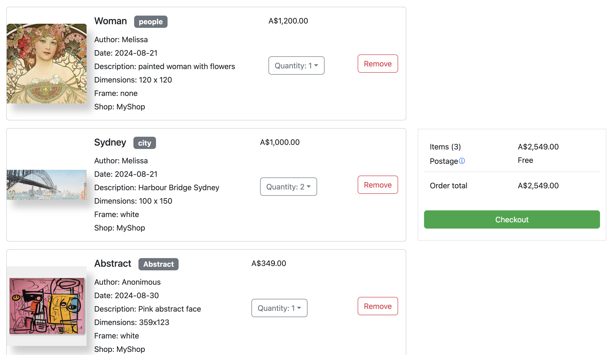

# Final Project for Bootcamp - E-commerce Platform

## Table of Contents

- [Project Overview](#project-overview)
- [Features](#features)
- [Technologies Used](#technologies-used)
- [Installation](#installation)
- [Usage](#usage)
- [API Endpoints](#api-endpoints)
- [Screenshots](#screenshots)
- [Contact](#contact)

## Project Overview

This is the final project for a Full Stack Software Development Bootcamp. It is an e-commerce platform that allows users to browse products, add items to a shopping cart, and complete purchases using Stripe for payments. Administrators have access to manage product categories, update product details, and track order statuses.

## Features

- **User Functionality**

  - Add products to the shopping cart
  - Login and Signup
  - Manage their delivery address
  - Checkout and complete purchases using Stripe
  - View order history and track order statuses
  - Browse products and categories - available soon

- **Admin Functionality**

  - Manage product categories
  - Add, edit, or delete products
  - Update order statuses (e.g., pending, shipped, delivered, cancelled)

- **General**
  - Secure payments via Stripe
  - REST API for back-end functionality
  - Responsive design for mobile and desktop

## Technologies Used

- **Front-End**: React, Redux, Bootstrap, CSS3
- **Back-End**: Node.js, Express
- **Database**: MongoDB (Mongoose)
- **Payment Integration**: Stripe API
- **Version Control**: Git

# Screenshots




## Installation

1. **Clone the repository:**

   ```bash
   git clone https://github.com/melvec/e-commerce-client.git
   cd e-commerce-client
   yarn install
   ```

2. **Create .env file the following variables:**
   VITE_APP_API_BASE_URL =
   VITE_APP_STRIPE_PUBLICABLEKEY=
   VITE_APP_STRIPE_SECRETKEY=

3. **Run the project**
   ```bash
   yarn dev
   ```
